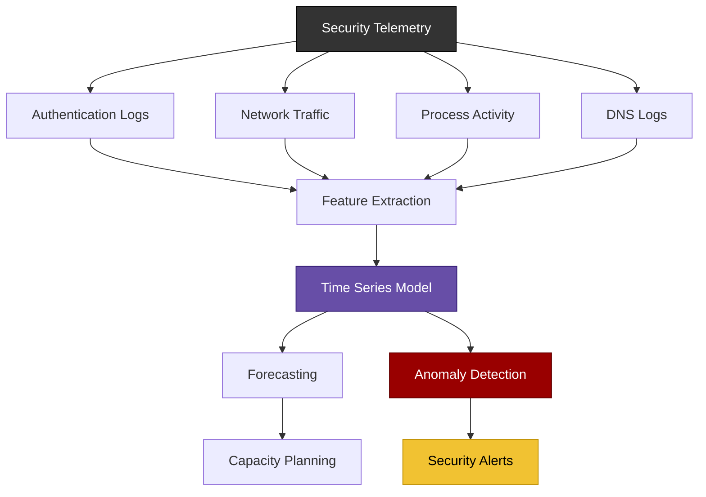

<div align="center">



# [Time Series](https://www.ibm.com/think/topics/time-series-model) Toolkit
</div>

[]()
[]()

<p align="center">
    <a href="https://github.com/cybersecurity-dev/"></a>
    &nbsp;
    <a href="https://www.youtube.com/@CyberThreatDefense"></a>
    &nbsp;
    <a href="https://cyberthreatdefence.com/my_awesome_lists"></a>
    
</p>

## 📖 Contents
- [My Other Awesome Lists](#my-other-awesome-lists)
- [Contributing](#contributing)
- [Contributors](#contributors)

<details>
 
 <summary>Install required tools on Linux</summary>
 
 ### For Ubuntu 18.04, 20.04, 22.04
 
 ```bash
 sudo apt-get update
 ```
 </details>
 
 
 <details>
 
 <summary>Install required python libs</summary>
 
 ### pip install
 ```bash
 pip install -r requirements.txt
 python3 setup.py install
 ```
 
 ### conda install
 ```bash
 conda config --add channels conda-forge
 conda install --file requirements_conda.txt
 python3 setup.py install
 ```
 
 </details>


##

### My Awesome Lists
You can access the my awesome lists [here](https://cyberthreatdefence.com/my_awesome_lists)

### Contributing
[Contributions of any kind welcome, just follow the guidelines](contributing.md)!

### Contributors
[Thanks goes to these contributors](https://github.com/cybersecurity-dev/Time-Series-Toolkit/graphs/contributors)!

[🔼 Back to top](#time-series-toolkit)
